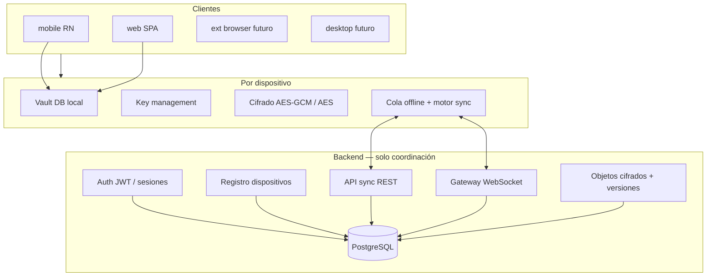
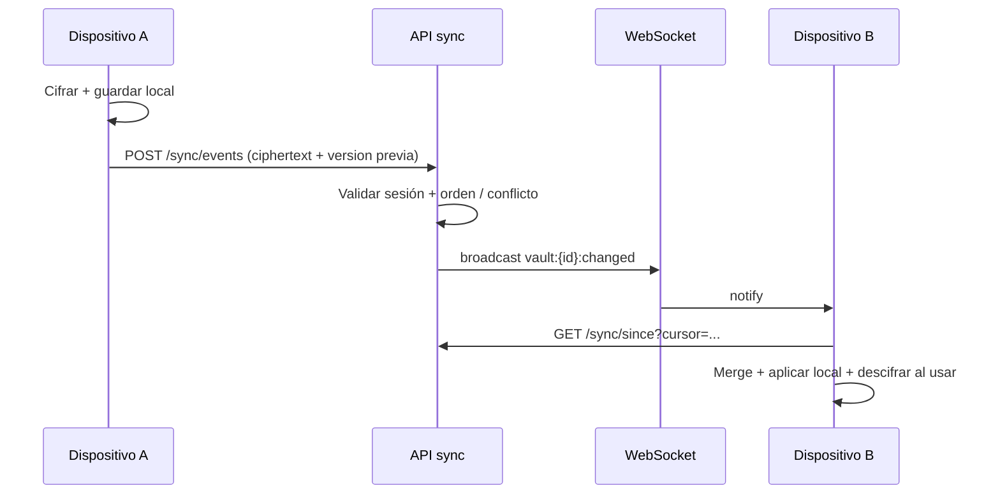

# Passtore — Arquitectura local-first + cifrado primero + sync opcional

Este documento define la arquitectura objetivo del proyecto. El backend **no** es un almacén de contraseñas en claro ni intenta descifrar datos del usuario: solo **metadatos**, **coordinación**, **transporte de ciphertext** y **sesiones**.

---

## Tabla de contenidos

1. [Arquitectura general](#1-arquitectura-general)
2. [Flujo de sincronización](#2-flujo-de-sincronización)
3. [Estrategia de encriptación](#3-estrategia-de-encriptación)
4. [Estrategia de autenticación](#4-estrategia-de-autenticación)
5. [Manejo de dispositivos](#5-manejo-de-dispositivos)
6. [Estrategia futura de autofill](#6-estrategia-futura-de-autofill)
7. [Estrategia offline-first](#7-estrategia-offline-first)
8. [Resolución de conflictos de sync](#8-resolución-de-conflictos-de-sync)
9. [Seguridad](#9-seguridad)
10. [Estructura del monorepo](#10-estructura-del-monorepo)

Apéndices: [Riesgos y problemas técnicos](#riesgos-y-problemas-técnicos), [Mejoras recomendadas](#mejoras-recomendadas).

---

## 1. Arquitectura general

### Principios

| Principio | Significado |
|-----------|-------------|
| **Local-first** | La fuente de verdad operativa es la base local; la red es opcional. |
| **Encrypted-first** | Todo secreto sale del dispositivo solo como ciphertext estructurado. |
| **Sync opcional** | El usuario puede usar Passtore solo offline; el sync mejora conveniencia. |

### Capas lógicas



- **Cliente**: UI, motor de matching autofill, biometría, secure storage, SQLite/vault.
- **Servidor**: identidad, lista de dispositivos, punteros a revisiones, **blobs cifrados opacos**, fan-out de eventos; **no** hay campo “password” interpretable.

### Qué deja de ser “CRUD de passwords en servidor”

El servidor no expone `GET /credentials` como lista de entidades descifrables. Expone algo equivalente a:

- **Vault revision / snapshot**: blob binario o JSON cifrado (opaco para el servidor).
- **Eventos incrementales**: `upsert`, `tombstone`, `blob_patch` con `contentVersion` / `vectorClock` / `timestamp` según el protocolo elegido (ver §8).

La migración desde el MVP actual (credenciales como filas con `encryptedPassword`) se describe en [IMPLEMENTATION_PHASES.md](./IMPLEMENTATION_PHASES.md).

---

## 2. Flujo de sincronización

### Modelo mental

1. El usuario modifica una credencial **solo en local**.
2. El motor de cifrado produce **registro cifrado** + **metadatos indexables** (dominio, título opaco hash opcional, etc. según política de privacidad).
3. El cliente encola un **evento de sync** (`CREDENTIAL_UPSERT`, `DELETE`, `VAULT_BLOB_PUSH`, etc.).
4. El backend persiste el **ciphertext** y un **monotonic version** por objeto o por vault.
5. Otros dispositivos reciben notificación (WebSocket) o hacen **pull incremental** (REST fallback).
6. El cliente remoto aplica eventos, actualiza SQLite, **solo entonces** descifra al usar.

### Tiempo real + REST

| Canal | Uso |
|-------|-----|
| **WebSocket** | Push de “hay cambios”, invalidación de cache, presencia liviana. |
| **REST** | Bootstrap, catch-up, clientes con WS cortado, subida de blobs grandes. |



---

## 3. Estrategia de encriptación

### Objetivo criptográfico

- **Datos en reposo (local)**: AES-256 (ideal **AES-256-GCM** con nonce único por mensaje; migrar desde AES-CBC genérico si aplica).
- **Clave de bóveda**: derivada con **Argon2id** o PBKDF2 con coste alto desde **contraseña maestra** o desde **clave aleatoria** guardada en Keychain/Keystore.
- **Transporte**: TLS obligatorio en producción; el ciphertext ya está blindado ante el servidor.

### Servicios en cliente (contrato)

| Servicio | Responsabilidad |
|----------|-----------------|
| `encryptionService` | Cifrar/descifrar campos y blobs; nunca loguear plaintext. |
| `keyManagementService` | Derivar, rotar, envolver claves; interfaz con Keychain/Keystore; política de biometría. |
| `secureStorageService` | Persistir secretos en contenedor seguro por plataforma. |

### Clave que “nunca sale del dispositivo sin protección”

Para **multi-dispositivo**, la realidad es: algo debe permitir que otro dispositivo descifre. Opciones estándar:

1. **Clave de bóveda envuelta** por clave de dispositivo + **intercambio** vía protocolo de emparejamiento (QR, código corto) verificado fuera de banda.
2. **Misma frase de recuperación / clave exportada** por el usuario (malus UX).
3. **Sync solo de blobs** que ya vienen cifrados con una **clave maestra** que el usuario introduce en cada dispositivo nuevo (más seguro, más fricción).

La arquitectura debe soportar varias “estrategias de enroll” sin cambiar el formato del blob en servidor (solo quién tiene la DEK).

---

## 4. Estrategia de autenticación

| Método | Rol |
|--------|-----|
| Email + contraseña | Autenticación **a la cuenta**; la contraseña de cuenta ≠ contraseña maestra del vault (recomendado separar). |
| OAuth (Google / Apple) | Igual: identidad; opcionalmente token para enroll de dispositivo. |
| Biometría | Desbloquea **clave local** / sesión corta; no sustituye backend auth por sí sola. |
| Passkeys / WebAuthn | Segundo factor o login sin password; ya parcialmente integrado; seguir como factor de **sesión**, no de DEK por defecto. |

El servidor solo ve tokens de sesión y **metadata** de dispositivos (nombre, clave pública de push opcional, último seen).

---

## 5. Manejo de dispositivos

Cada dispositivo tiene:

- `deviceId` estable (UUID almacenado en secure storage).
- **Claves de transporte** opcionales (clave pública X25519 o similar) para **emparejamiento E2E** futuro.
- Estado de sync: último `cursor`, último vector/revision.

Flujos:

- **Registrar dispositivo**: tras login, el cliente envía `deviceId` + plataforma + versión app.
- **Revocar dispositivo**: el usuario invalida un dispositivo; el servidor deja de encolar eventos hacia ese push subscription (no puede borrar datos locales en remoto sin agente; por eso importa **cifrado**).

---

## 6. Estrategia futura de autofill

### Separación de conceptos

| Componente | Función |
|------------|---------|
| `autofillMatchingEngine` | Dado contexto (URL, package Android, bundle iOS), rankea candidatos usando **metadatos locales** (dominio, path, app id). |
| `autofillService` | API unificada para registrar credenciales visibles al SO cuando exista bridge nativo. |
| `credentialProviderService` | iOS: `ASCredentialIdentityStore`; Android: datasets. |
| `browserExtensionBridge` | Mensajería `postMessage` / native messaging hacia extensión (futuro). |

### Privacidad en matching

- Índices locales pueden guardar **dominio normalizado** y **origen**; evitar enviar URLs completas al servidor si no es necesario.
- Descifrado **solo** tras desbloqueo (biometría / PIN).

Documentación ampliada: [AUTOFILL_PLATFORM_ARCHITECTURE.md](./AUTOFILL_PLATFORM_ARCHITECTURE.md).

---

## 7. Estrategia offline-first

- **Lectura / escritura**: siempre contra SQLite primero; éxito UI = commit local.
- **Cola de salida**: tabla `outbox` con eventos pendientes (retry exponencial).
- **Estado de red**: listener global; al reconectar, `flushOutbox` + `pullSince`.
- **Indicadores UX**: “pendiente de sync”, “conflicto”, “solo local”.

---

## 8. Resolución de conflictos de sync

### Origen del conflicto

Dos dispositivos editan la misma credencial sin ver el evento del otro → divergencia de `baseVersion`.

### Estrategias (de menor a mayor complejidad)

1. **Last-write-wins (LWW)** por `updatedAt` confiable + **detección** de conflicto (marcar “requiere revisión”).
2. **CRDT / merge por campo** para metadatos no secretos (difícil si todo va dentro de un blob cifrado monolítico).
3. **Por entidad versionada**: cada credencial tiene `version`; el servidor rechaza push si `baseVersion` no coincide → cliente debe **leer remoto**, merge manual o automático.

**Recomendación práctica para MVP sync**: **version por fila + rechazo optimista + UI de resolución** para colisiones detectadas.

---

## 9. Seguridad

### Amenazas

| Amenaza | Mitigación |
|---------|------------|
| Servidor comprometido | Solo ciphertext; no hay DEK en servidor. |
| XSS en web | Minimizar tiempo en memoria; no persistir plaintext; CSP estricta; considerar Web Worker para crypto; **riesgo inherente** vs apps nativas. |
| Malware local | Fuera del modelo; Keychain/Keystore reduce superficie. |
| Replay de eventos | `eventId` monotónico + firma de cadena o deduplicación por idempotency key. |

### Lo que el backend debe **prohibir**

- Aceptar plaintext de contraseñas en endpoints de producción (solo desarrollo con flags explícitos si acaso).
- Logs con ciphertext largos sin necesidad.

---

## 10. Estructura del monorepo

Objetivo (evolutivo; ver [MONOREPO_LAYOUT.md](./MONOREPO_LAYOUT.md)):

```
Passtore/
├── apps/
│   ├── mobile/          # React Native CLI
│   └── web/             # Vite SPA
├── packages/
│   ├── core/            # tipos, protocolo sync, constantes (@passtore/core)
│   ├── crypto-contracts/ # opcional: interfaces puras TS
│   └── config/          # eslint/tsconfig compartido
├── services/
│   └── api/             # NestJS (hoy backend/)
├── docs/
└── docker-compose.yml
```

Las apps de cliente viven en `apps/mobile/` y `apps/web/`; el API Nest sigue en `backend/` (evolución futura opcional: `services/api/`).

---

## Riesgos y problemas técnicos

1. **Recuperación entre dispositivos sin que el servidor tenga la DEK**: exige UX de transferencia segura (QR, código, recuperación).
2. **Blob monolítico vs registros**: un vault-file único simplifica servidor pero empeora merges; registros por ítem facilitan conflictos granulares pero más IO.
3. **WebSocket y orden**: necesitas **cursor de sync** estable y pruebas de reconexión.
4. **Tamaño de blobs en Postgres**: usar BYTEA/TEXT con límites y compresión **antes** de cifrar en cliente si se desea.
5. **Paridad legal/compliance**: exportación de datos y borrado (“right to be forgotten”) sobre **metadatos** y blobs del usuario.

---

## Mejoras recomendadas

- Sustituir AES genérico por **AES-GCM** con API única en todos los clientes.
- Introducir **UUID v7** para orden temporal legible en logs y sync.
- **Observabilidad**: métricas de latencia sync sin contenido (solo tamaños agregados).
- **Tests property-based** para motor de conflictos y matching de dominios.

---

## Documentos relacionados

- [DECISIONS.md](./DECISIONS.md) — decisiones resumidas y enlaces a ADRs.
- [STORAGE_EVALUATION.md](./STORAGE_EVALUATION.md) — SQLite vs Realm vs WatermelonDB.
- [IMPLEMENTATION_PHASES.md](./IMPLEMENTATION_PHASES.md) — fases de implementación.
- [AUTOFILL_PLATFORM_ARCHITECTURE.md](./AUTOFILL_PLATFORM_ARCHITECTURE.md) — autofill multiplataforma.
